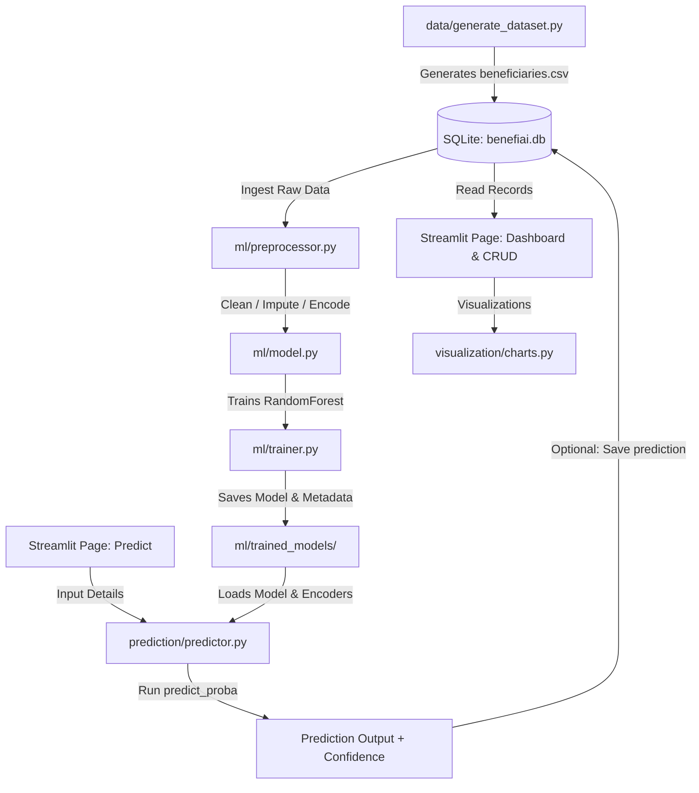

# BenefiAI – NGO Beneficiary Eligibility Analyzer

An intelligent, production-grade, and responsive web application built with **Streamlit**, **SQLite**, **Pandas**, **Scikit-Learn**, and **Plotly** to manage beneficiary records, perform interactive demographic analytics, train classification models, and predict beneficiary eligibility with confidence metrics.

---

## 📁 Project Structure

Below is the final, submission-ready project directory structure. Every directory contains clean, modular, and fully documented source code:

```text
BenefiAI/
│
├── app.py                       # Main Streamlit web application & UI orchestrator
├── requirements.txt             # Python dependencies list
├── README.md                    # Project documentation (this file)
│
├── data/
│   ├── generate_dataset.py      # Synthetic dataset generator with faker & rule injections
│   └── beneficiaries.csv        # Seed dataset exported as CSV
│
├── database/
│   ├── __init__.py              # Package initializer
│   ├── db_setup.py              # SQLite connection helper & table schema setup
│   └── crud.py                  # Database CRUD utility functions
│
├── ml/
│   ├── __init__.py              # Package initializer
│   ├── preprocessor.py          # Data ingestion, cleaning, imputation & encoding pipeline
│   ├── model.py                 # RandomForest model training, evaluation & joblib persistence
│   ├── trainer.py               # Standalone or programmatic pipeline executor
│   └── trained_models/
│       ├── rf_model.pkl         # Serialized RandomForestClassifier
│       ├── encoders.pkl         # Serialized LabelEncoders
│       └── model_meta.json      # Metadata containing metrics, hyperparams & feature importances
│
├── prediction/
│   ├── __init__.py              # Package initializer
│   └── predictor.py             # Inference pipeline & prediction database logs
│
└── visualization/
    ├── __init__.py              # Package initializer
    └── charts.py                # Plotly Express and Graph Objects visualization suite
```

---

## ⚙️ Features & Architecture

### 1. SQLite Database & CRUD Operations
- **`database/db_setup.py`**: Initializes the database and creates two tables:
  - `beneficiaries`: Stores the ground-truth demographic profiles and historical eligibility classifications.
  - `predictions`: Logs every live prediction run through the model for audit trails and future monitoring.
- **`database/crud.py`**: Houses pure-Python functions for Create, Read, Update, and Delete operations using Pandas SQL read functions and raw SQL parameterization to prevent SQL injection.

### 2. Dataset Analytics & Dynamic Visualization
- **`visualization/charts.py`**: A custom visualization suite powered by Plotly to render beautiful dark-theme glassmorphism charts:
  - *Income Distribution by Eligibility* (overlapping histogram)
  - *Eligibility Distribution* (donut chart)
  - *Education Level Distribution* (grouped horizontal bar chart)
  - *Employment Status Breakdown* (stacked bar chart)
  - *ROC Curve* and *Confusion Matrix* for model evaluation
  - *Probability Gauge* and *Feature Importance* for single prediction explainability.

### 3. Machine Learning Training Pipeline
- **`ml/preprocessor.py`**: Cleans raw data (stripping whitespaces, standardizing string cases), removes duplicates, handles missing values (imputing numeric features with the median and categorical features with the mode), and label-encodes categoricals.
- **`ml/model.py`**: Implements a `RandomForestClassifier` with balanced class weights to train on the preprocessed dataset. Computes precision, recall, F1-score, ROC-AUC, confusion matrix, and 5-fold cross-validation scores, then serializes everything using `joblib`.
- **`ml/trainer.py`**: Orchestrates the training pipeline from end to end.

### 4. Interactive Eligibility Prediction
- **`prediction/predictor.py`**: Performs real-time inference on applicant demographics. Loads the trained RandomForest model and encoders, preprocesses user inputs using the identical label encoding applied in training, and runs `predict_proba()` to output eligibility classification alongside a confidence score.
- **Audit Logs**: Provides a "Save to Database" button that records the inference profile, prediction, confidence score, and model timestamp in the `predictions` table.

---

## 🚀 Installation & Setup

### 1. Clone or Copy the Repository
Ensure all project files are placed in the root directory `BenefiAI/`.

### 2. Install Required Dependencies
Run the following command to install the required libraries:
```bash
pip install -r requirements.txt
```

### 3. Initialize Database and Seed Data
Generate the synthetic dataset containing 300+ realistic records and populate the SQLite database:
```bash
python data/generate_dataset.py
```
This script will initialize `database/benefiai.db` and populate the `beneficiaries` table.

### 4. Run the Streamlit Application
Launch the web interface locally:
```bash
streamlit run app.py
```
The application will open automatically in your browser (typically at `http://localhost:8501`).

---

## 💡 Project Workflow Explanation



### End-to-End Workflow:
1. **Bootstrap Phase**: The synthetic generator seeds the SQLite database with records containing demographics and eligibility statuses calculated from weighted rules (e.g., lower income and higher family size boost eligibility).
2. **Management Phase**: NGO administrators use the **Beneficiary Management** page to search, add, edit, or delete beneficiary profiles. Every change is stored immediately in SQLite.
3. **Training Phase**: The user navigates to the **Model Training** page and clicks "Train Model Now". `ml/trainer.py` extracts the records from SQLite, cleans them, fits a RandomForest, computes metrics, and serializes the model.
4. **Prediction Phase**: On the **Eligibility Prediction** page, administrators enter a new applicant's details. The app loads the trained model, encodes the features, predicts the outcome with a confidence percentage, and lets the user save the prediction audit trail back to SQLite.
